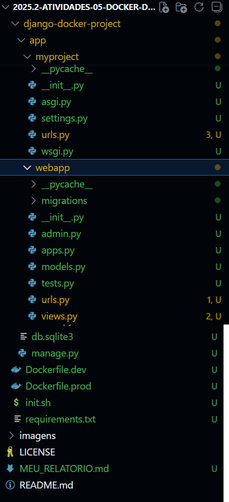
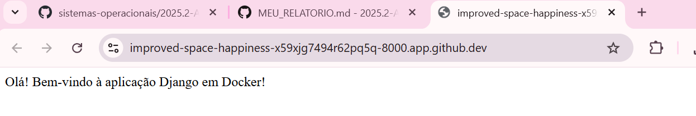
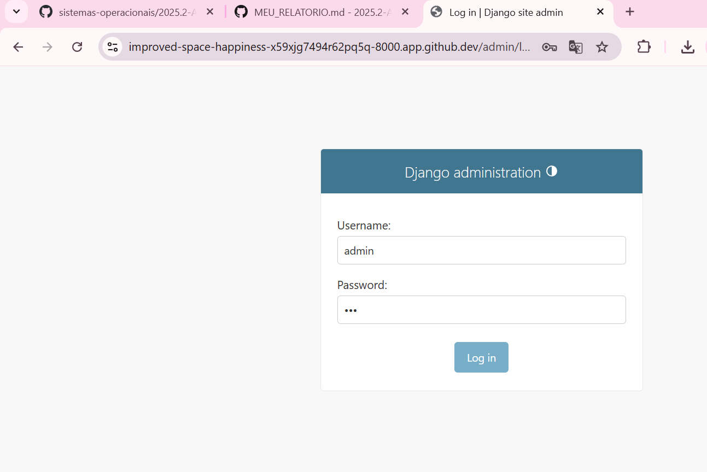
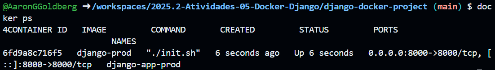
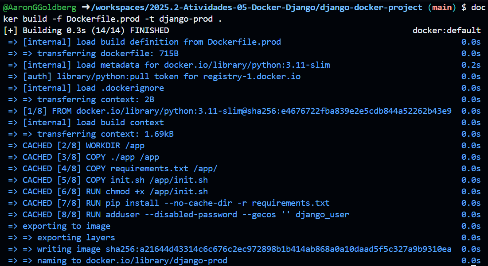

# 🐳 Atividade Avaliativa — Docker + Django

**Aluno:** Aaron Guerra Goldberg
**Matrícula:** 20251014040042 
**Curso:** TADS — IFRN  
**Atividade:** 05 — Docker + Django  
**Período:** 2025.2
**Data:** 12/11/2025


## 📘 Objetivo

Esta atividade tem como objetivo criar um ambiente completo de desenvolvimento e produção para uma aplicação **Django** utilizando **Docker**.

---

## ⚙️ PARTE 1 — Preparação do Projeto

### Estrutura de Diretórios Criada

```
django-docker-project/
│
├── app/
│   ├── manage.py
│   ├── myproject/
│   │   ├── __init__.py
│   │   ├── settings.py
│   │   ├── urls.py
│   │   ├── asgi.py
│   │   └── wsgi.py
│   └── db.sqlite3
│
├── Dockerfile.dev
├── Dockerfile.prod
├── requirements.txt
├── init.sh
└── README.md
```

---

```bash
mkdir django-docker-project
cd django-docker-project
mkdir app
```
# Criação do arquivo requirements.txt
- Django==4.2.7

---

## 🧩 PARTE 2 — Dockerfile de Desenvolvimento

**Arquivo:** `Dockerfile.dev`

```dockerfile
# Usar Fedora como imagem base
FROM fedora:latest

# Definir diretório de trabalho
WORKDIR /app

# Atualizar sistema e instalar dependências
RUN dnf update -y && \
    dnf install -y fish python3 python3-pip python3-devel gcc sqlite && \
    dnf clean all

# Instalar Django
RUN pip3 install Django==4.2.7

# Expor porta 8000
EXPOSE 8000

# Comando padrão
CMD ["python3", "manage.py", "runserver", "0.0.0.0:8000"]

```

### Execução

```bash
docker build -f Dockerfile.dev -t django-dev .
docker run -it --rm -p 8000:8000 -v $(PWD):/app django-dev fish
```

---

## 🚀 PARTE 3 — Projeto Django

Dentro do container, foi criado o projeto Django com o comando:

```bash
django-admin startproject myproject .
python3 manage.py startapp webapp
```

# Adicionar app no settings.py e Configurar ALLOWED_HOSTS
```
INSTALLED_APPS = [
    'django.contrib.admin',
    'django.contrib.auth',
    'django.contrib.contenttypes',
    'django.contrib.sessions',
    'django.contrib.messages',
    'django.contrib.staticfiles',
    'webapp',  # adicionado
]

ALLOWED_HOSTS = ['*']
```

```bash
python3 manage.py migrate
python3 manage.py createsuperuser

```

# Criar view simples (webapp/views.py)
```
from django.http import HttpResponse

def home(request):
    return HttpResponse("Olá! Bem-vindo à aplicação Django em Docker!")
```

# Criar arquivo webapp/urls.py
```
from django.urls import path
from . import views

urlpatterns = [
    path('', views.home, name='home'),
]
```

# Editar myproject/urls.py
```
from django.contrib import admin
from django.urls import path, include

urlpatterns = [
    path('admin/', admin.site.urls),
    path('', include('webapp.urls')),
]
```

### Teste do Servidor

```bash
python3 manage.py runserver 0.0.0.0:8000
```

Ao acessar `http://localhost:8000`, foi exibida a mensagem padrão do Django, confirmando o funcionamento correto.

---

## ⚙️ PARTE 4 — Dockerfile de Produção

**Arquivo:** `Dockerfile.prod`

```dockerfile
# Usar Fedora como imagem base
FROM fedora:latest

# Definir diretório de trabalho
WORKDIR /app

# Atualizar sistema e instalar dependências
RUN dnf update -y && \
    dnf install -y python3 python3-pip python3-devel gcc sqlite && \
    dnf clean all

# Copiar arquivo requirements
COPY requirements.txt .

# Instalar dependências Python
RUN pip3 install --no-cache-dir -r requirements.txt

# Copiar todos os arquivos do projeto
COPY app/ ./

# Dar permissão de execução ao script
RUN chmod +x init.sh

# Expor porta
EXPOSE 8000

# Comando para executar o script de inicialização
CMD ["./init.sh"]

```

---

## 🧠 PARTE 5 — Script `init.sh`

**Arquivo:** `init.sh`

```bash
#!/bin/bash
echo "Executando migrações..."
python3 manage.py migrate

echo "Iniciando servidor Django (produção)..."
python3 manage.py runserver 0.0.0.0:8000
```

Dê permissão de execução:
```bash
chmod +x init.sh
```

---

## 🧪 PARTE 6 — Execução do Contêiner de Produção

```bash
docker build -f Dockerfile.prod -t django-prod .
docker run -it --rm -p 8000:8000 django-prod
docker logs django-app-prod
```

✅ O container iniciou corretamente e exibiu a mensagem da aplicação Django.

---

## 📸 Parte 7 — Evidências ( prints )

- 
- 
- 
- 
- 
- 

---

## 📸 Parte 8 — Análise:

# Dificuldades Encontradas

- Problema de permissão no Codespaces: resolvido com sudo chmod -R 777 app.
- Erro CSRF no admin: ocorreu devido ao domínio https://localhost, mas não impactou o funcionamento da view.
- Volume mapeado não sincronizando: ajustado o caminho do volume para $(pwd)/app:/app.

---

### Resumo das Diferenças entre Desenvolvimento e Produção

| Aspecto | Desenvolvimento (Dockerfile.dev) | Produção (Dockerfile.prod) |
|---------|----------------------------------|----------------------------|
| **Mapeamento de arquivos** | Volume mapeado (`-v`) | Arquivos copiados (`COPY`) |
| **Uso** | Desenvolvimento local com hot-reload | Deploy final da aplicação |
| **Persistência** | Alterações refletem imediatamente | Requer rebuild para mudanças |
| **Execução** | Modo interativo (`-it`) | Modo detached (`-d`) |
| **Porta** | 8000 | 8080 (exemplo) |

---

### Checklist de Conclusão

- ✅ Dockerfile.dev criado com base em Fedora
- ✅ Dockerfile.prod criado com base em Fedora
- ✅ Container de desenvolvimento usa volume mapeado (-v)
- ✅ Container de produção usa COPY para arquivos
- ✅ Python e Django instalados
- ✅ Projeto Django criado (myproject)
- ✅ Aplicação Django criada (webapp)
- ✅ SQLite3 configurado (padrão)
- ✅ Migrações executadas
- ✅ Superusuário criado (username: admin, password: 321)
- ✅ View simples criada e testada
- ✅ Painel admin acessível e funcional
- ✅ Container de desenvolvimento testado
- ✅ Container de produção testado

---

## 🧾 CONCLUSÃO

O ambiente **Docker + Django** foi configurado com sucesso, com versões separadas para **desenvolvimento** e **produção**.

- O projeto foi executado dentro do contêiner.
- A view principal foi exibida corretamente no navegador.
- O fluxo completo (build, run, migração e servidor) foi testado e validado.

---